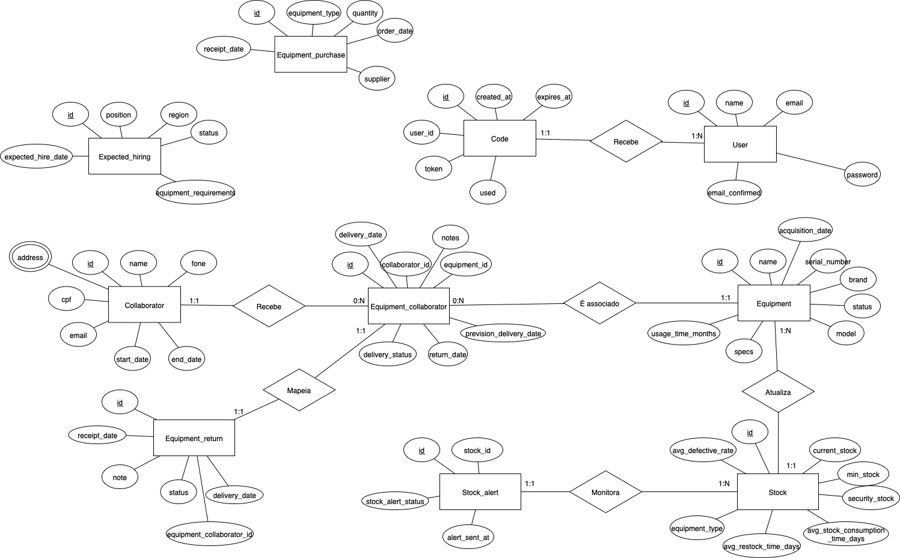
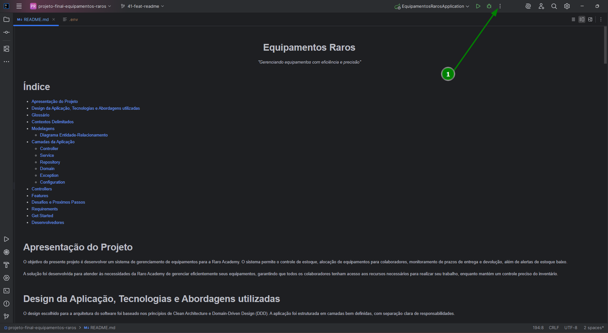
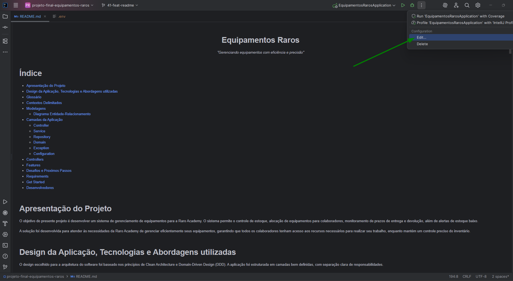
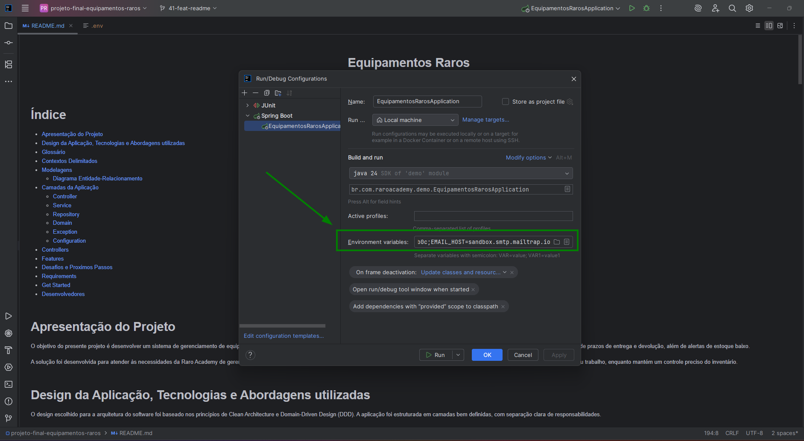
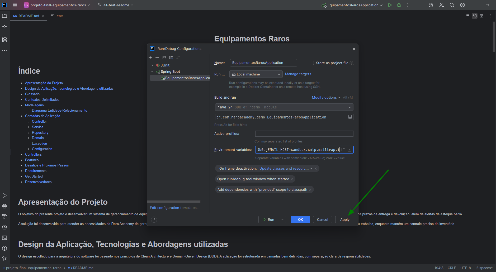
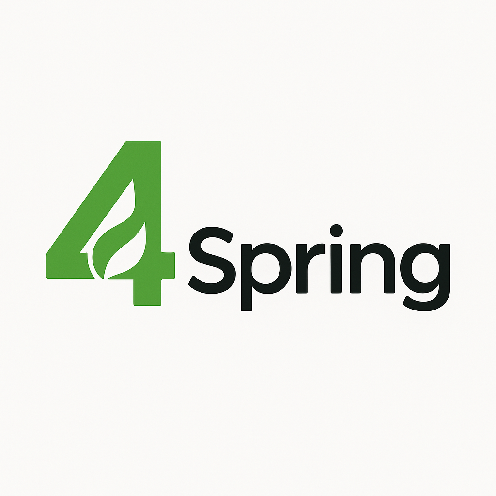

<div align="center">
<h1>Equipamentos Raros</h1>
</div>

<div align="center">
<p><i>"Gerenciando equipamentos com eficiência e precisão"</i></p>
</div>

# Índice
- [Apresentação do Projeto](#Apresentação-do-projeto)
- [Design da Aplicação, Tecnologias e Abordagens utilizadas](#Design-da-aplicação-tecnologias-e-abordagens-utilizadas)
- [Glossário](#Glossário)
- [Contextos Delimitados](#Contextos-delimitados)
- [Modelagens](#Modelagen)
    - [Diagrama Entidade-Relacionamento](#Diagrama-entidade-relacionamento)
- [Camadas da Aplicação](#Camadas-da-aplicação)
    - [Controller](#Controller)
    - [Service](#Service)
    - [Repository](#Repository)
    - [Domain](#Domain)
    - [Exception](#Exception)
    - [Configuration](#Configuration)
- [Controllers](#Controllers)
- [Features](#Features)
- [Desafios e Proximos Passos](#Desafios-e-proximos-passos)
- [Requirements](#Requirements)
- [Get Started](#Get-started)
- [Fluxo Execução](#fluxo-de-execução-para-testar-a-aplicação-com-um-todo)
- [Desenvolvedores](#Desenvolvedores)

# Apresentação do Projeto
O objetivo do presente projeto é desenvolver um sistema de gerenciamento de equipamentos para a Raro Academy. O sistema permite o controle de estoque, alocação de equipamentos para colaboradores, monitoramento de prazos de entrega e devolução, além de alertas de estoque baixo.

A solução foi desenvolvida para atender às necessidades da Raro Academy de gerenciar eficientemente seus equipamentos, garantindo que todos os colaboradores tenham acesso aos recursos necessários para realizar seu trabalho, enquanto mantém um controle preciso do inventário.

# Design da Aplicação, Tecnologias e Abordagens utilizadas
O design escolhido para a arquitetura do software foi baseado nos princípios de Clean Architecture e Domain-Driven Design (DDD). A aplicação foi estruturada em camadas bem definidas, com separação clara de responsabilidades.

As principais tecnologias utilizadas no projeto incluem:
- **Spring Boot**: Framework para desenvolvimento de aplicações Java
- **Spring Data JPA**: Para persistência de dados
- **Spring Security**: Para autenticação e autorização
- **Feign Client**: Para integração com APIs externas
- **PostgreSQL**: Banco de dados relacional
- **Lombok**: Para redução de código boilerplate
- **Spring Scheduling**: Para tarefas agendadas
- **Spring Async**: Para processamento assíncrono

A aplicação segue os princípios SOLID e utiliza padrões de projeto como Repository, Service, DTO, Builder e Factory para garantir um código limpo, testável e de fácil manutenção.

# Glossário
- **Equipamento**: Dispositivo eletrônico (notebook, monitor, etc.) gerenciado pelo sistema.
- **Colaborador**: Funcionário da empresa que pode receber equipamentos.
- **Estoque**: Quantidade disponível de cada tipo de equipamento.
- **Alerta de Estoque**: Notificação gerada quando o estoque de um tipo de equipamento está baixo.
- **Compra de Equipamento**: Registro de aquisição de novos equipamentos.
- **Previsão de Contratação**: Planejamento para futuras contratações que necessitarão de equipamentos.
- **Previsão de Devolução**: Data esperada para devolução de equipamentos por colaboradores.
- **Entrega de Equipamento**: Processo de atribuir um equipamento a um colaborador.
- **Devolução de Equipamento**: Processo de receber um equipamento de volta de um colaborador.
- **Usuário**: Pessoa com acesso ao sistema, podendo ter diferentes níveis de permissão.

# Contextos Delimitados
- **Gestão de Equipamentos**
    - Cadastro, atualização e remoção de equipamentos
    - Controle de status dos equipamentos (disponível, em uso, em manutenção)
    - Registro de especificações técnicas

- **Gestão de Colaboradores**
    - Cadastro, atualização e remoção de colaboradores
    - Controle de contratos (início e término)
    - Gerenciamento de endereços

- **Controle de Estoque**
    - Monitoramento de níveis de estoque por tipo de equipamento
    - Geração de alertas para estoque baixo
    - Envio de notificações por email

- **Alocação de Equipamentos**
    - Atribuição de equipamentos a colaboradores
    - Cálculo de prazos de entrega
    - Registro de devoluções
    - Acompanhamento de equipamentos em uso

- **Planejamento**
    - Previsão de contratações futuras
    - Previsão de devoluções
    - Planejamento de compras

- **Autenticação e Autorização**
    - Gerenciamento de usuários
    - Controle de acesso
    - Verificação de códigos

# Modelagens
## Diagrama Entidade-Relacionamento
O diagrama entidade-relacionamento representa as principais entidades do sistema e seus relacionamentos:




- **Equipment**: Representa os equipamentos com atributos como tipo, número de série, marca, modelo, especificações, data de aquisição, tempo de uso e status.
- **Collaborator**: Representa os colaboradores com atributos como nome, CPF, email, telefone, endereço e datas de contrato.
- **EquipmentCollaborator**: Relacionamento entre equipamentos e colaboradores, registrando datas de entrega, previsão de entrega, devolução e status.
- **Stock**: Controle de estoque por tipo de equipamento.
- **StockAlert**: Alertas gerados quando o estoque está abaixo do limite.
- **EquipmentPurchases**: Registro de compras de equipamentos.
- **ExpectedHiring**: Previsão de contratações futuras.
- **ExpectedReturn**: Previsão de devoluções de equipamentos.
- **User**: Usuários do sistema.
- **Code**: Códigos de verificação para usuários.
- **Address**: Endereços dos colaboradores.

# Camadas da Aplicação
## Controller
Camada responsável por receber as requisições HTTP, validar os dados de entrada e delegar o processamento para a camada de serviço. Implementa os endpoints da API REST.

## Service
Camada que contém a lógica de negócio da aplicação. Implementa as regras de negócio, valida as operações e coordena o acesso aos dados através dos repositórios.

## Repository
Camada responsável pela persistência dos dados. Utiliza o Spring Data JPA para interagir com o banco de dados.

## Domain
Camada que contém as entidades do domínio, DTOs, enums e outras classes que representam o modelo de negócio.

## Exception
Camada que define exceções personalizadas para tratamento de erros específicos da aplicação.

## Configuration
Camada que contém as configurações da aplicação, como segurança, agendamento de tarefas e beans personalizados.

# Controllers
- **AuthController**: Gerencia autenticação e autorização (/auth)
- **UserController**: Gerencia usuários do sistema (/users)
- **CollaboratorController**: Gerencia colaboradores (/collaborators)
- **EquipmentController**: Gerencia equipamentos (/equipments)
- **EquipmentCollaboratorController**: Gerencia a relação entre equipamentos e colaboradores (/equipments-collaborators)
- **StockController**: Gerencia o estoque de equipamentos (/stock)
- **StockAlertController**: Gerencia alertas de estoque baixo (/stock-alerts)
- **EquipmentPurchasesController**: Gerencia compras de equipamentos (/equipment-purchases)
- **ExpectedHiringController**: Gerencia previsões de contratações (/expected-hirings)
- **ExpectedReturnController**: Gerencia previsões de devoluções (/expected-returns)

# Features
- [x] Cadastro e gerenciamento de equipamentos
- [x] Cadastro e gerenciamento de colaboradores
- [x] Controle de estoque de equipamentos
- [x] Alertas de estoque baixo com notificação por email
- [x] Atribuição de equipamentos a colaboradores
- [x] Cálculo de prazos de entrega baseado na localização
- [x] Registro de devoluções de equipamentos
- [x] Previsão de contratações futuras
- [x] Previsão de devoluções de equipamentos
- [x] Autenticação e autorização de usuários
- [x] Integração com ViaCEP para validação de endereços

# Desafios e Proximos Passos
- [ ] Implementação de dashboard para visualização de métricas
- [ ] Integração com sistemas de inventário
- [ ] Aplicativo mobile para facilitar o processo de entrega e devolução
- [ ] Implementação de QR Code para identificação rápida de equipamentos
- [ ] Sistema de manutenção preventiva baseado no tempo de uso dos equipamentos

# Requisitos
- Java 17+
- PostgreSQL
- Dcoker

# Get Started

```bash
# Clone este repositório:
git clone https://git.raroacademy.com.br/arthur.leite/projeto-final-equipamentos-raros.git
```
```bash 
# Entre na pasta do projeto ou abra a mesma usando o Intellij
cd projeto-final-equipamentos-raros
```  
```bash 
# Configurações para rodar o banco via docker
#crie o arquivo .env com as informações para seu banco
  POSTGRES_USER=postgres
  POSTGRES_PASSWORD=12345
  POSTGRES_DB=bd-raro
# Execute o docker compose para subir o banco via docker
docker docker-compose up -d
```  
```bash 
# Antes de executar a aplicação configure as variáveis de ambiente do intellij
siga o passo a passo:
```


```bash
# variáveis
POSTGRES_USER=postgres;POSTGRES_PASSWORD=12345;POSTGRES_DB=bd-raro;EMAIL_USERNAME=bc3b602d07dc99;EMAIL_PASSWORD=daf0cc35b40b0c;EMAIL_HOST=sandbox.smtp.mailtrap.io
``` 



```
# Observações finais
depois de subir o banco via docker e configurar as variaveis de ambiente do intellij a aplicação estará pronto para
ser startada.
``` 
# Fluxo de execução para testar a aplicação com um todo

Depois da aplicação estiver executando corretamente, será criado um usuario Super Admin feito atraves de um insert
no banco de dados com intuito de ajudar quem for testar a aplicação, esse usario terá os seguintes login e senha
para ser usado no endpoint de auth no swagger: http://localhost:8080/swagger-ui/index.html


```
{
  "email": "admin@raroacademy.com.br",
  "password": "admin123"
}
``` 


# Desenvolvedores

| Nome           | Git                                                     |
|----------------|---------------------------------------------------------|
| Arthur Leite   | [Perfil](https://git.raroacademy.com.br/arthur.leite)   |
| Elias Santos   | [Perfil](https://git.raroacademy.com.br/elias.santos)   |
| João Machado   | [Perfil](https://git.raroacademy.com.br/joao.Machado)   |
| Kefer Linhares | [Perfil](https://git.raroacademy.com.br/kefer.linhares) |

Desenvolvido pela equipe 4spring como projeto final do curso de Java.

<div style="text-align: center;">
  
</div>